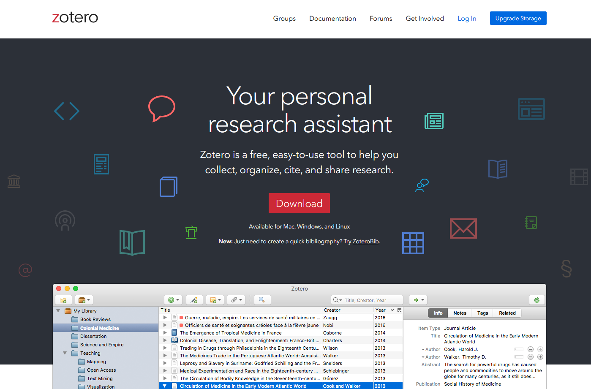
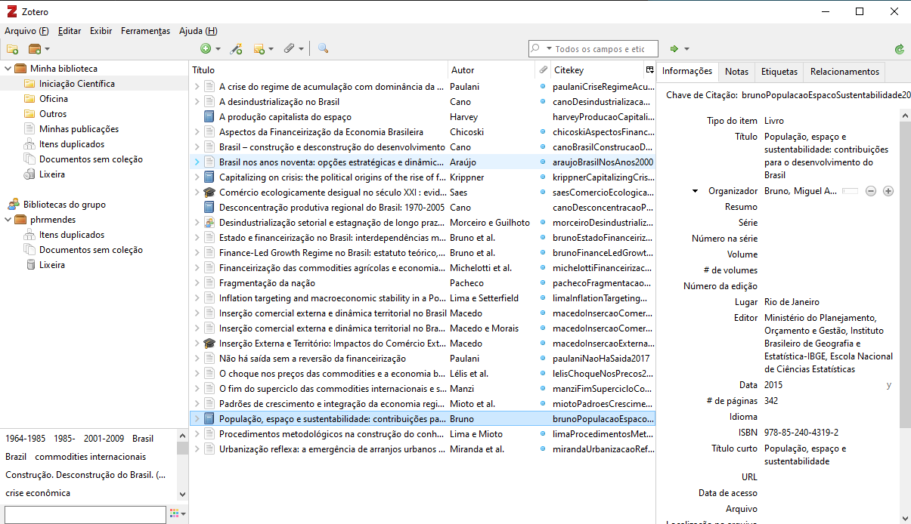
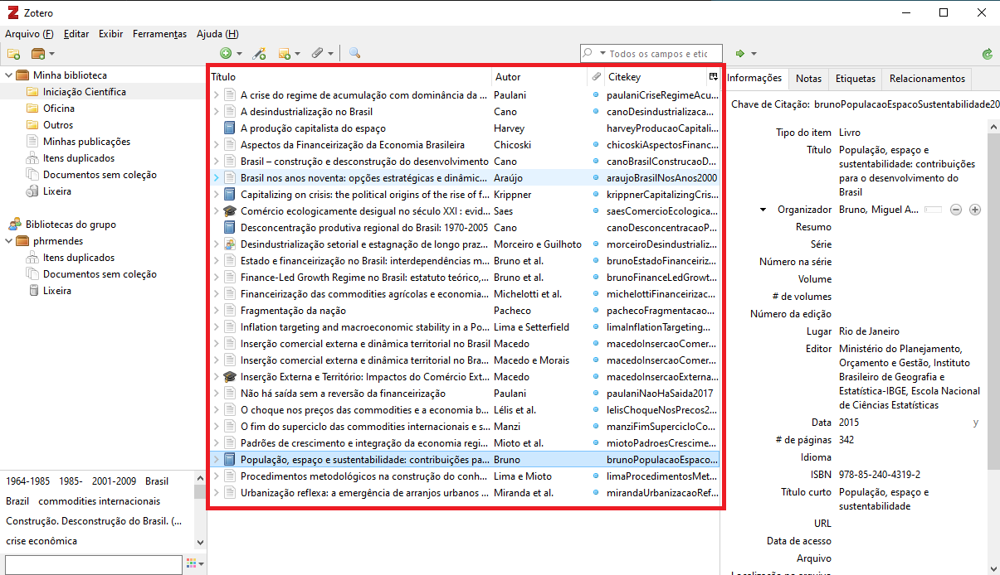
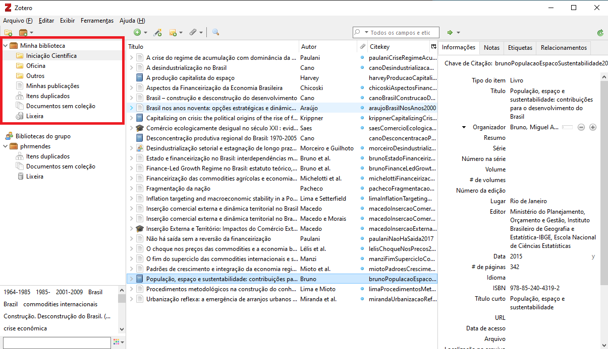
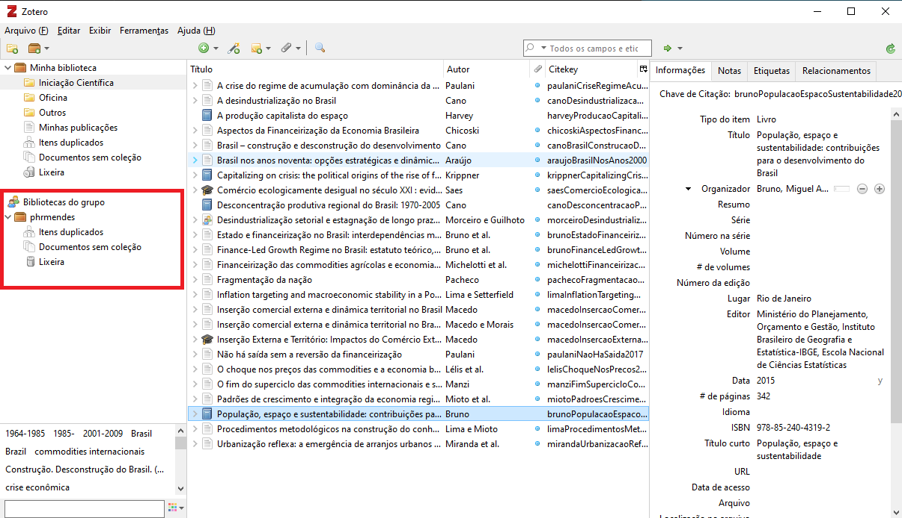
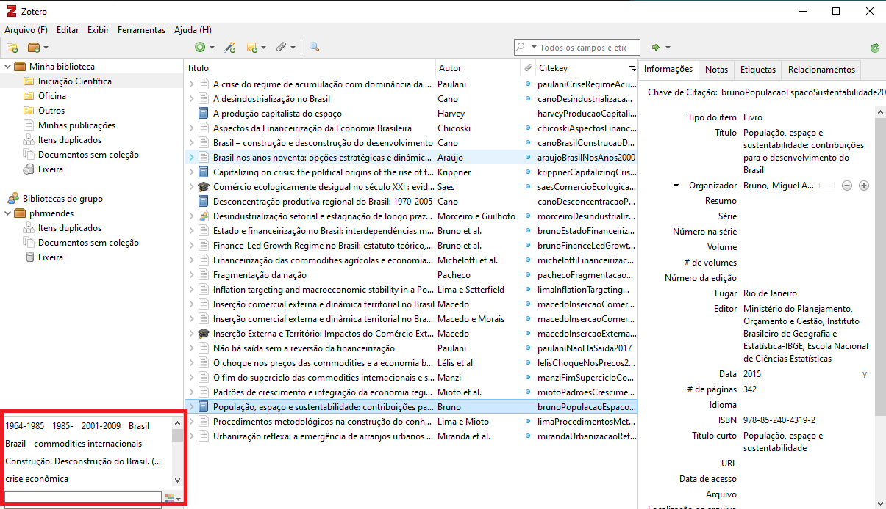
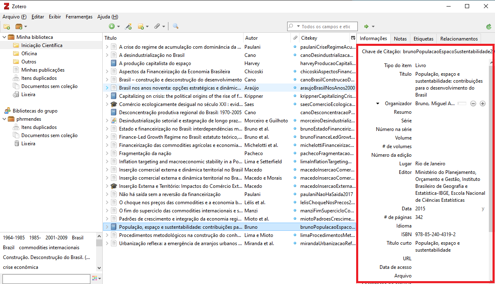
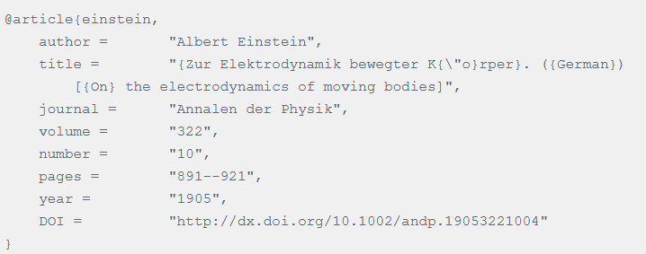

[compilação]: # pandoc -t beamer curso-zotero.md -o curso-zotero.pdf

# Importância do uso de ferramentas acadêmicas

- Acadêmicos precisam parar de se preocupar com formatação ABNT!
- A curva de aprendizagem pode ser lenta, mas a praticidade e economia de tempo fazem valer a pena
- Organizar pastas com dezenas ou centenas de arquivos .pdf se torna inviável com o tempo
- Sites e repositórios de artigos e dissertações são preparados para esse tipo de uso

# Ferramentas que serão apresentadas

- Processadores de texto e linguagens de escrita acadêmica
- Gerenciador de referências
  - Zotero
    - Zotfile
- Integração entre ferramentas
  - Zotero/Libreoffice
  - Zotero/Navegador

# Gerenciadores de referências

**Gerenciadores de referência** são softwares acadêmicos que guardam e organizam referências bibliográficas. Uma vez salvas nesses softwares, as referências podem ser sincronizadas e usadas em qualquer computador, ou até mesmo online.

Além disso, possuem integração tanto com processadores de texto (Microsoft Word, Google Docs, Libreoffice) como com linguagens de escrita acadêmica (Latex, Pandoc).

# Gerenciadores de referências

Os dois gerenciadores mais famosos são o **Mendeley** e o **Zotero**. Ambos desempenham as mesmas funções, porém o Mendeley é um software "freemium" da Elsevier, já o Zotero é um software totalmente gratuito e *open source* gerenciado por uma comunidade de acadêmicos e desenvolvedores.

\vspace{0.5cm}

\centering
{width=100}
\hspace{2cm}
{width=100}

# Gerenciadores de referências

Para quem é a favor da iniciativa Open Access, talvez usar o Mendeley não seja a melhor opção, já que é um software proprietário da Elsevier, empresa que possui práticas no mínimo questionáveis na área de publicação científica.

Dica de podcast sobre o tema:

\centering
{width=170}

# Zotero

Site de download do Zotero: https://www.zotero.org/

{width=250}

# Zotero

Importante instalar a extensão para navegador

{width=500}

# Conhecendo a interface - Zotero

{width=400}

# Conhecendo a interface - Zotero

{width=400}

# Conhecendo a interface - Zotero

{width=400}

# Conhecendo a interface - Zotero

{width=400}

# Conhecendo a interface - Zotero

{width=400}

# Conhecendo a interface - Zotero

{width=400}

# Integração com outras ferramentas

É possível exportar a bibliografia salva tanto para ferramentas tradicionais (LibreOffice, Word, Google Docs) como para Pandoc e Latex.

Ele faz isso ou por meio de:

- Extensões e plugins
- Arquivos .bib (Better BibTex)

# Integração com outras ferramentas

Modelo de arquivo .bib:

{width=400}

# Importando artigos

- O Zotero consegue importar livros e artigos direto do programa (DOI, ISBN)
- A extensão para navegador permite importar metadados e arquivos de várias fontes (Google Acadêmico, SciElo, ResearchGate, sites de revistas)

# Gerenciando arquivos (Zotfile)

- O Zotfile é um plugin que gerencia seus arquivos importados
- Com ele, é possível escolher um padrão para nome de arquivos, sincronizar com alguma pasta na nuvem e até configurar importações automáticas

Link para download: http://zotfile.com/

# Prática!

# Referências

CHIGNELL, S. Tutorial: The Best Reference Manager Setup (Zotero + ZotFile + Cloud Storage). [s.l: s.n.]. Disponível em: <https://www.researchgate.net/publication/325828616_Tutorial_The_Best_Reference_Manager_Setup_Zotero_ZotFile_Cloud_Storage> 