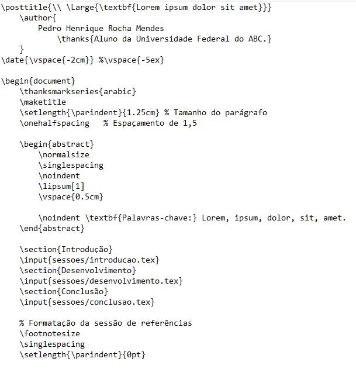
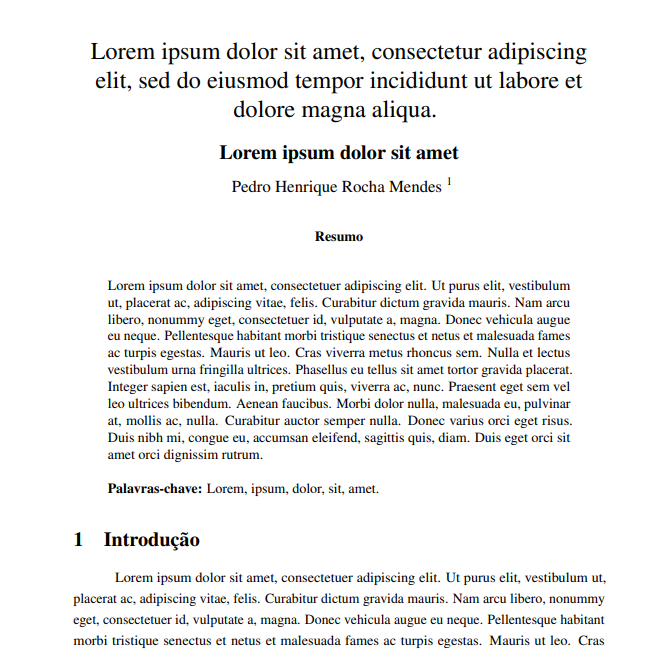
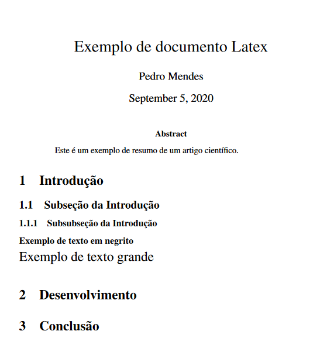
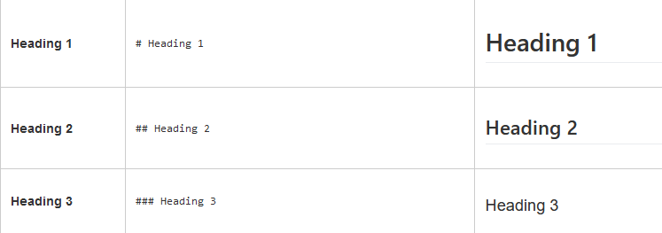
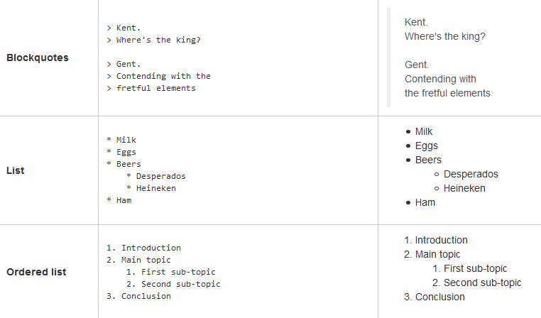
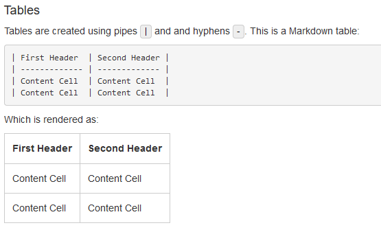

[compilação]: # pandoc -t beamer oficina-escrita-academica.md -o oficina-escrita-academica.pdf

# Importância do uso de ferramentas acadêmicas

- O pacote Office é caro e está cada dia mais difícil de conseguir por meios alternativos
- O Libreoffice é uma boa alternativa, porém é tão limitado quanto o Office no gerenciamento de bibliografia e padrão de escrita acadêmica
- Acadêmicos precisam parar de se preocupar com formatação ABNT!

# Importância do uso de ferramentas acadêmicas

- Revistas internacionais usam ferramentas desse tipo para submissão de artigos
- Embora a curva de aprendizado seja lenta, a praticidade e economia de tempo fazem valer a pena

# Ferramentas que serão apresentadas

- Processadores de texto e linguagens de escrita acadêmica
- Gerenciador de referências
  - Zotero
    - Zotfile
- Integração entre ferramentas
  - Zotero/Libreoffice
  - Zotero/Navegador

# Processadores de texto

Existem basicamente dois tipos:

- WYSIWYG (What You See Is What You Get)
  - A maneira como o texto está formatado na tela é como ele vai ser impresso.
  - Word, Libreoffice, Google Docs
- WYSIWYM (What You See Is What You Mean)
  - O documento é gerado a partir de comandos, que são compilados e exportados em algum arquivo (.pdf, .docx).
  - Latex, HTML, Markdown

# Processadores de texto

Processadores de texto a base de comandos são mais precisos e profissionais por possuírem formatação padronizada e exata, além de possibilitarem maior personalização e automatização de processos de escrita.

Além disso, com modelos prontos, você só precisa formatar tudo uma vez só, fazendo apenas pequenos ajustes, dependendo de sua necessidade.

# Processadores de texto

Exemplo:

{width=220}

# Processadores de texto

Resultado:

{width=220}

# Processadores de texto

Processadores de texto como Latex e Pandoc também possuem uma série de ótimas ferramentas para construção de tabelas, fórmulas matemáticas, gráficos e etc.

# Processadores de texto
\footnotesize
Equações:
```
\sigma=\sqrt{{\sum_{i=1}^n (X_{i}-\bar X)^2} \over n}
```
\Large
Resultado:
$$
\sigma=\sqrt{{\sum_{i=1}^n(X_{i}-\bar X)^2} \over n}
$$

# Processadores de texto

Tabelas:
```
# Em Latex
\begin{table}[]
\begin{tabular}{|l|l|}
\hline
Título 1 & Título 2 \\ \hline
Item 1   & Item 2   \\ \hline
\end{tabular}
\end{table}
```

# Processadores de texto

```
# Em Markdown
|Coluna 1|Coluna 2|
|--------|--------|
|Item 1  |Item 2  |
```
Resultado:

|Coluna 1|Coluna 2|
|--------|--------|
|Item 1  |Item 2  |

# Latex

O Latex é um processador lógico de texto. É compatível com todos os sistemas operacionais de desktop (Windows, Linux, MacOS). Ele funciona da seguinte maneira:

- Primeiro, definimos os pacotes a serem utilizados e o tipo de documento que será gerado
- Depois, configuramos os formatos de citações e referências e os layouts do documento

Depois disso, ele está pronto para trabalhar!

# Latex

Para compilar seus documentos, é necessário o download de um interpretador de instruções. Aqui usaremos o compilador online Overleaf, que é completo e gratuito para uso normal.

\centering
\vspace{0.5cm}
{width=300}

# Latex

Para começar a escrever um documento em Latex, podemos usar qualquer aplicativo de escrita de texto. Aqui vamos usar a ferramenta online Overleaf, mas existem uma série de aplicativos para facilitar a vida de quem utiliza Latex. Para que um arquivo possa ser compilado como Latex, ele precisa ser salvo no formato ".tex".

# Estrutura de documento - Latex

Um documento Latex se divide em três partes:
- Preâmbulo
- Documento
- Referências (opcional)

A sintaxe dos comandos sempre vai ser essa:
```
\comando{parâmetro}
```
Ou essa:
```
\comando
```

# Criando um documento simples - Latex

**Preâmbulo:**
\footnotesize

```
\documentclass[
    12pt,           % Fonte n. 12
    a4paper,        % Folha A4
    english,        % Idioma adicional
    brazil          % Idioma principal
]{article}          % Pacote ABNT
\usepackage{graphicx}   % Pacote para adicionar figuras
\usepackage{fontenc}    % Pacote para reconhecer acentos
\usepackage{times}      % Fonte Times New Roman
\usepackage{ragged2e}   % Facilita indentação do texto
```
# Criando um documento simples - Latex
**Documento:**
\footnotesize
```
\begin{document}  % Inicia a escrita do documento
  \setlength{\parindent}{1.25cm} % Tamanho do parágrafo
  \onehalfspacing   % Espaçamento de 1,5

  \title{Exemplo de documento Latex}  % Título do documento
  \author{Pedro Mendes} % Autor do documento
  \maketitle % Fazer título aparecer

  \begin{abstract} % Inicia resumo
    Este é um exemplo de resumo de um artigo científico.
  \end{abstract} % Finaliza resumo
```

# Criando um documento simples - Latex

\footnotesize
```
  \chapter{Capítulo 1}
    \section{Introdução}
      \subsection{Subseção da Introdução}
        \subsubsection{Subsubseção da Introdução}
        \textbf{Exemplo de texto em negrito}
        \Large Exemplo de texto grande
    \section{Desenvolvimento}
    \section{Conclusão}
\end{document} % Fim do documento
```
# Criando um documento simples - Latex

**Resultado:**

\centering
{width=200}

# Finalizando - Latex

O Latex é uma linguagem que te dá muitas possibilidades. A partir desse modelo simples, já é possível escrever um artigo acadêmico simples para um trabalho de uma matéria! Lembrando que você **sempre** pode reutilizar modelos, assim que quase sempre só é necessário apenas uma configuração de documento.

Link para uma apostila completa de Latex: http://each.uspnet.usp.br/sarajane/wp-content/uploads/2016/10/manual-latex-1.pdf

# Pandoc

O Pandoc é um conversor universal de documentos. Ele converte um tipo de documento para outro (ex: .docx para .pdf).

Ele é usado para escrita acadêmica por sua capacidade de converter documentos do formato ".md" para ".pdf" usando Latex. Parece complicado né? Mas não é!

# Pandoc

\footnotesize

O Pandoc usa uma linguagem de marcação mais simples para fazer **quase a mesma coisa** que o Latex. Essa linguagem se chama **Markdown**.

Para escrever em Markdown, você só precisa de um editor de texto e do Pandoc instalado no seu computador. O Pandoc também está disponível em todas os sistemas operacionais de desktop.

Link para download: https://github.com/jgm/pandoc/releases/download/2.10.1/pandoc-2.10.1-windows-x86_64.msi

Link para o manual oficial do Pandoc: https://pandoc.org/MANUAL.pdf

Link para um tutorial de como usar Markdown: https://joplinapp.org/markdown/

# Pandoc

**Sintaxe do Markdown**:

\centering
{width=400}

# Pandoc

\centering
{width=400}

# Pandoc

\centering
{width=400}

# Pandoc

\centering
{width=400}

# Alguns apontamentos

O Latex é uma linguagem mais complexa, o Pandoc já é mais simplificado.

Para tarefas complexas, como escrever uma dissertação ou um TCC, é recomendado o uso do Latex.

Para coisas mais simples como slides, artigos e trabalhos de disciplinas, o Pandoc se adequa mais. Além disso, o Pandoc permite ajustes finos usando comandos em Latex!

# Gerenciadores de referências

**Gerenciadores de referência** são softwares para acadêmicos que guardam e organizam referências bibliográficas. Uma vez salvas nesses softwares, as referências podem ser sincronizadas e usadas em qualquer computador, ou até mesmo online.

Além disso, possuem integração tanto com processadores de texto (Microsoft Word, Google Docs, Libreoffice) como com linguagens de escrita acadêmica (Latex, Pandoc).

# Gerenciadores de referências

Os dois gerenciadores mais famosos são o **Mendeley** e o **Zotero**. Ambos desempenham as mesmas funções, porém o Mendeley é um software "freemium" da Elsevier, já o Zotero é um software totalmente gratuito e *open source* gerenciado por uma comunidade de acadêmicos e desenvolvedores.

\vspace{0.5cm}

\centering
{width=100}
\hspace{2cm}
{width=100}

# Gerenciadores de referências

Para quem é a favor da iniciativa Open Access, talvez usar o Mendeley não seja a melhor opção, já que é um software proprietário da Elsevier, empresa que possui práticas no mínimo questionáveis na área de publicação científica.

Dica de podcast sobre o tema:

\centering
{width=200}

# Zotero

Site de download do Zotero: https://www.zotero.org/

{width=250}

# Zotero

Importante instalar a extensão para navegador

{width=300}

# Conhecendo a interface - Zotero


# Conhecendo a interface - Zotero


# Conhecendo a interface - Zotero


# Conhecendo a interface - Zotero


# Conhecendo a interface - Zotero


# Conhecendo a interface - Zotero


# Integração com outras ferramentas

É possível exportar a bibliografia salva tanto para ferramentas tradicionais (LibreOffice, Word, Google Docs) como para Pandoc e Latex.

Ele faz isso ou por meio de:

- Extensões e plugins
- Arquivos .bib (Better BibTex)

# Integração com outras ferramentas

Modelo de arquivo .bib:


